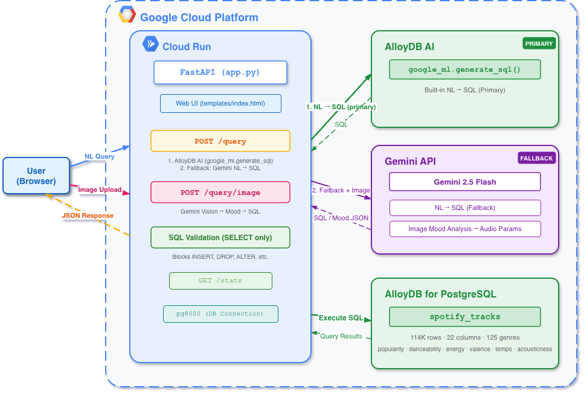

# Spotify NLQ Agent — Natural Language Spotify Track Explorer

> Gen AI Academy APAC Edition — Cohort 1, Track 3: AlloyDB AI

Ask anything about music in plain language — or just upload a photo. This agent turns your words and images into SQL queries across **114K Spotify tracks**, powered by **AlloyDB AI** and **Gemini 2.5 Flash** on **Google Cloud Run**.

## Architecture

## Features

| Feature | Description |
|---------|-------------|
| Natural Language Query | Ask questions in plain language, AlloyDB AI converts to SQL |
| Image Mood Search | Upload a photo, Gemini analyzes mood and recommends matching tracks |
| SQL Transparency | Every query shows the generated SQL alongside results |
| Live Statistics | Real-time artist count, average BPM from AlloyDB |
| SQL Injection Guard | SELECT-only validation, blocks dangerous queries |

## Web UI

Spotify-inspired dark theme with two modes

- **Text Query Tab** — type a question, get results with generated SQL
- **Image Upload Tab** — drag & drop an image, get mood-matched track recommendations

Built with Tailwind CSS, Pretendard font, particle animations, typing effects, and genre marquee scroll.

## Tech Stack

| Layer | Technology |
|-------|-----------|
| Frontend | HTML + Tailwind CSS + Vanilla JS |
| Backend | FastAPI (Python) |
| NL-to-SQL | AlloyDB AI (`google_ml.generate_sql`) |
| Image Analysis | Gemini 2.5 Flash |
| Database | AlloyDB for PostgreSQL |
| DB Driver | pg8000 |
| Deployment | Google Cloud Run (Docker) |
| Dataset | [Spotify Tracks](https://huggingface.co/datasets/maharshipandya/spotify-tracks-dataset) — 114K tracks, 125 genres, 20+ audio features |

## Example Queries

**Text Queries:**
- `"에너지 높은 댄스곡 인기순 10개 보여줘"` → filters high energy + dance genre
- `"BPM 80~120 사이의 밝은 느낌 어쿠스틱 곡"` → tempo range + high valence
- `"장르별 평균 danceability 비교"` → GROUP BY aggregation
- `"Jason Mraz 곡 중 인기순 정렬"` → artist search

**Image Upload:**
- Sunset beach photo → calm, acoustic tracks with low energy
- City night photo → energetic, electronic tracks with high tempo

## Dataset

- **Source**: [maharshipandya/spotify-tracks-dataset](https://huggingface.co/datasets/maharshipandya/spotify-tracks-dataset) (HuggingFace)
- **Size**: 114,000 tracks across 125 genres
- **Key Columns**: popularity, danceability, energy, valence, tempo, acousticness, speechiness, instrumentalness, liveness

## License

Dataset: BSD License
